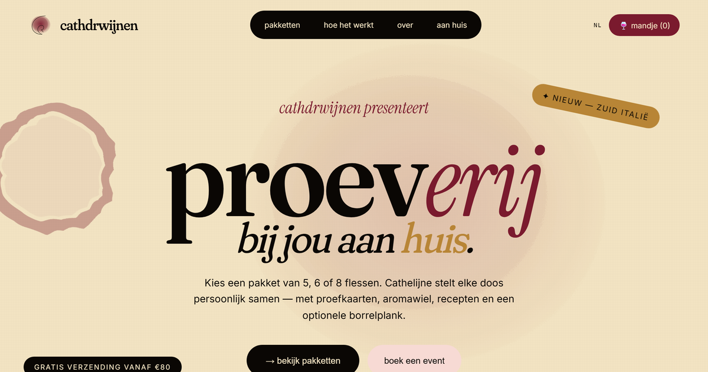
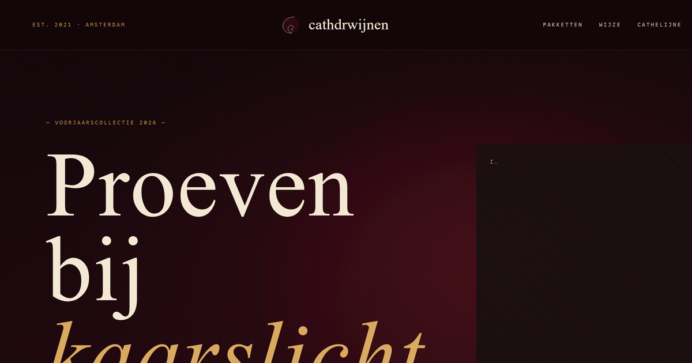
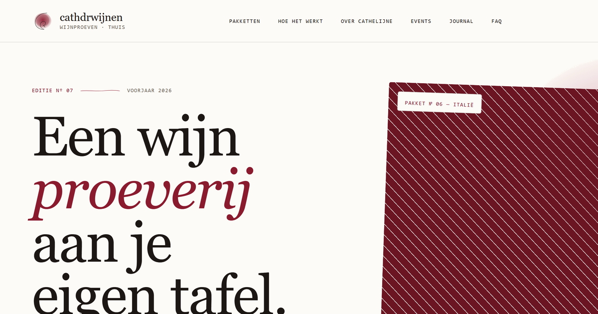

<div align="center">

# cathdrwijnen

**Three landing-page design concepts for a home wine-tasting service** — a single gallery lets you preview each direction and open the full design.


[](https://github.com/ErbenDriessen/Cathdrwijnen/actions/workflows/links.yml)
[](https://erbendriessen.github.io/Cathdrwijnen/)

</div>

## 🍷 Design variants

Three distinct directions for the same brand, all reachable from the [gallery](https://erbendriessen.github.io/Cathdrwijnen/):

| [**Salon**](https://erbendriessen.github.io/Cathdrwijnen/salon.html) | [**Carafe**](https://erbendriessen.github.io/Cathdrwijnen/carafe.html) | [**Journal**](https://erbendriessen.github.io/Cathdrwijnen/journal.html) |
| :---: | :---: | :---: |
| [](https://erbendriessen.github.io/Cathdrwijnen/salon.html) | [](https://erbendriessen.github.io/Cathdrwijnen/carafe.html) | [](https://erbendriessen.github.io/Cathdrwijnen/journal.html) |
| Warm & editorial | Dark & candlelit | Light & paper-like |

## ✨ Features

- **Three design directions** — pick a vibe from a single gallery: Salon, Carafe and Journal.
- **Home tasting packages** — 5, 6 or 8 bottles, personally curated, with tasting cards, an aroma wheel and recipe pairings.
- **"Aan huis" booking form** — a working contact form (Formspree) with a hidden honeypot for spam protection.
- **Fully responsive** — swipe-snap card carousels, a full-screen mobile menu, and layouts that hold up down to ~360px.
- **Hand-built CSS art** — wine stains, watercolor blobs and polaroids drawn with SVG filters and gradients — no images required.
- **SEO & social ready** — per-page meta descriptions, Open Graph / Twitter cards, canonical URLs and an SVG favicon.
- **Zero framework, zero build** — plain HTML, CSS and a sprinkle of vanilla JS. Just open it.

## 🛠 Tech Stack

- **HTML5** — a gallery landing page + three standalone designs
- **CSS3** — custom properties, grid, scroll-snap, SVG filters, keyframe animation
- **Vanilla JavaScript** — mobile nav toggle + a forced light color-scheme
- **Google Fonts** — Fraunces, Instrument Serif, Inter, DM Serif Display, Caveat, Cormorant Garamond, Italiana
- **Formspree** — serverless contact-form handling
- **GitHub Pages** — static hosting, with a link-checking CI workflow

## 📁 Project structure

```text
Cathdrwijnen/
├── index.html          # gallery — links to the three designs
├── salon.html          # design 1 — warm & editorial
├── carafe.html         # design 2 — dark & candlelit
├── journal.html        # design 3 — light & paper-like
├── css/styles.css      # shared styles (used by salon.html)
├── js/script.js        # mobile nav + light-scheme lock
├── 404.html            # branded not-found page
└── assets/             # demo GIF, preview images, favicon
```

## 🚀 Getting Started

No dependencies and no build — clone and open, or serve the folder with any static server.

```bash
git clone https://github.com/ErbenDriessen/Cathdrwijnen.git
cd Cathdrwijnen

# Option A — just open the gallery in your browser
start index.html        # Windows
# open index.html       # macOS
# xdg-open index.html   # Linux

# Option B — serve locally (recommended, mirrors GitHub Pages)
python -m http.server 8000
# then visit http://localhost:8000
```

## 📄 License

Personal / client concept project. © 2026 Erben Driessen — all rights reserved.
